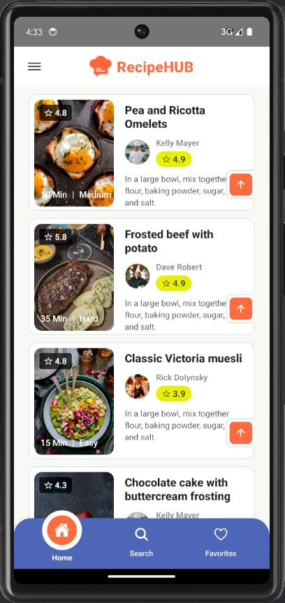
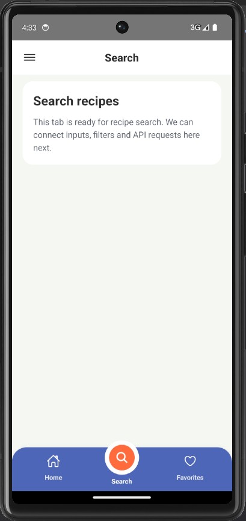
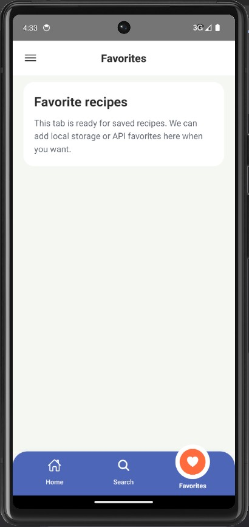
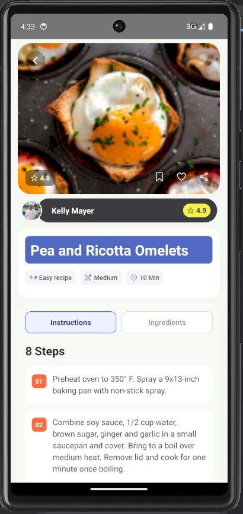
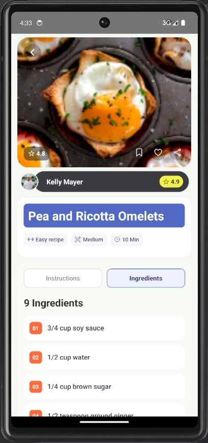
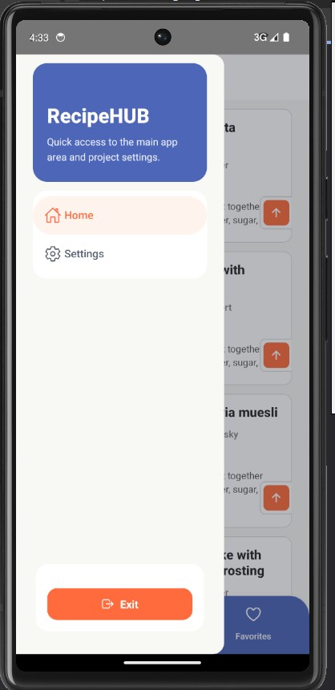
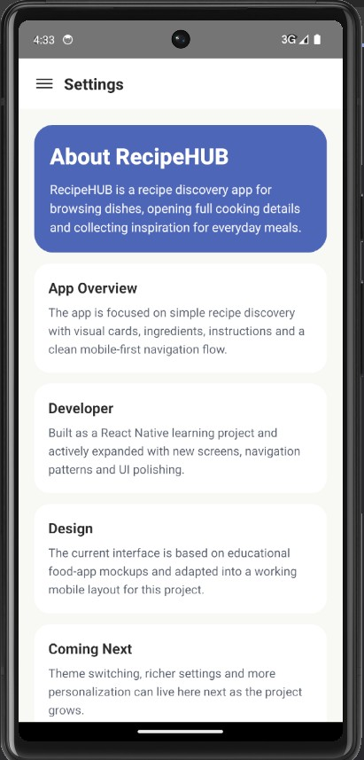

### Скріни Навігації застосунку RecipeHUB.

### Відео Навігації застосунку RecipeHUB.

### Опис домашнього завдання

## Завдання 1. Проєктування навігаційної структури
Відкрийте свій дизайн (Figma, макет тощо) та визначте:
- Які типи навігації потрібні (Stack, Tab, Drawer).
- Які екрани повинні бути зв’язані між собою.
- Які параметри передаються між екранами (наприклад, itemId для екрана з деталями щодо продукту / предмета).

Приклад:
- Головний екран → Стек навігації.
- Профіль, Налаштування → Tab Navigation.
- Меню застосунку → Drawer Navigation. 

## Завдання 2. Реалізація навігації
- Створіть навігаційні контейнери:
Stack.Navigator для лінійних переходів (наприклад, головний екран → деталі товару).
Tab.Navigator для швидкого доступу до основних розділів (наприклад, головна, кошик, історія).
Drawer.Navigator для додаткових функцій (наприклад, фільтри, підтримка).
- Інтегруйте створені компоненти в екрани:
Використовуйте ваші кастомні кнопки, картки, заголовки.
Застосовуйте стилізацію, щоб навігація гармоніювала з дизайном.

## Завдання 3. Передача даних між екранами
- Реалізуйте передачу параметрів через navigation.navigate().
- Використовуйте route.params для відображення динамічного контенту.

## Завдання 4. Стилізація навігаційних елементів
- Налаштуйте заголовки, кнопки «Назад», іконки вкладок.
- Використовуйте options для кастомних стилів.

## Завдання 5. Адаптивність і тестування
- Перевірте коректність відображення на різних пристроях (iOS / Android).
- Забезпечте роботу жестів (наприклад, свайп для Drawer Navigation).
- Протестуйте передачу даних та обробку помилок (наприклад, якщо productId не передано).

## Додаткові вимоги:
- Модульність: Навігаційні стеки / вкладки мають бути в окремих файлах (наприклад, /navigation/StackNavigator.js).
- Документація: Додайте коментарі до коду, де пояснюються складні частини навігації.
- Чистота коду: Використовуйте константи для назв екранів (наприклад, SCREENS.HOME).

## Підготовка та завантаження домашнього завдання
1. Відкрийте свій файл [Ваше прізвище]_cross_assignment_2 у Figma.
2. Виконайте завдання 1-5 та додаткові вимоги, використовуючи React Native.
3. Завантажте код на Git-репозиторій і додайте скриншоти або відео з демонстрацією роботи навігації (додати в README.md).
4. Прикріпіть посилання в LMS.
5. Збережіть архів із кодом та скриншотами або відео роботи навігації в застосунку на свій комп’ютер. Збережений архів має називатись [Ваше прізвище]_cross_assignment_4.
6. Прикріпіть його в LMS у форматі zip.
7. Відправте на перевірку.